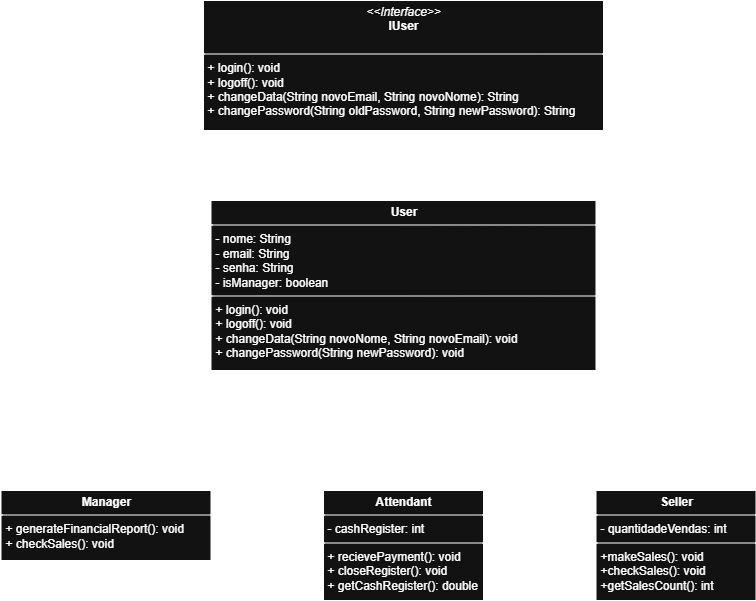

# 🎯 Sistema de Gerenciamento de Usuários

Este projeto implementa um **sistema de gerenciamento de usuários** para uma empresa, utilizando conceitos de **programação orientada a objetos** como **herança**, **polimorfismo**, **encapsulamento** e **interfaces**.

## Exercício Proposto:

### Crie uma hierarquia de classes que definam os tipos de usuários de um sistema, use os seguintes requisitos:

- Classe Gerente que terá os atributos: Nome, Email, Senha e um atributo que informa se ele é administrador, esse último deve ser sempre verdadeiro;
- Classe Vendedor que terá os seguintes atributos: Nome, Email, Senha, Quantidade de vendas e um atributo que informa se ele é administrador, esse útimo deve ser sempre falso;
- Classe Atendente que terá os seguintes atributos: Nome, Email, Senha, Valor em caixa e um atributo que informa se ele é administrador, esse ultimo deve ser sempre falso.
- **Cada classe deve ter seus respectivos getters e setters ( para atributos que façam sentido ter) e as classes devem ter os seguintes métodos** 

* A classe Gerente deve ter os métodos Gerar relatório financeiro, Consultar vendas, Realizar login, Realizar logff, alterar dados, alterar senha;
* A classe Vendedor deve ter os métodos Realizar venda ( incrementar o número de vendas quando acionado), Consultar vendas, Realizar login, Realizar logoff, alterar dados, alterar senha;
* A classe Atendente deve ter os métodos Receber pagamentos (onde o método recebe um valor que deve ser incrementado no valor em caixa), Fechar o caixa, Realizar Login, Realizar logoff, alterar dados e alterar senha;

## 📝 Visão Geral

O sistema define diferentes tipos de usuários:

### 1. Gerente
- **Atributos:** `nome`, `email`, `senha`, `administrador` (sempre verdadeiro)
- **Métodos:**
    - `gerarRelatorioFinanceiro()`
    - `consultarVendas()`
    - `login()`
    - `logoff()`
    - `alterarDados()`
    - `alterarSenha()`

### 2. Vendedor
- **Atributos:** `nome`, `email`, `senha`, `quantidadeVendas`, `administrador` (sempre falso)
- **Métodos:**
    - `realizarVenda()`
    - `consultarVendas()`
    - `login()`
    - `logoff()`
    - `alterarDados()`
    - `alterarSenha()`

### 3. Atendente
- **Atributos:** `nome`, `email`, `senha`, `valorEmCaixa`, `administrador` (sempre falso)
- **Métodos:**
    - `receberPagamento()`
    - `fecharCaixa()`
    - `login()`
    - `logoff()`
    - `alterarDados()`
    - `alterarSenha()`

Todos os usuários implementam a **interface `IUser`** e herdam da classe abstrata **User**, que fornece atributos e métodos comuns.

---

## 📦 Estrutura do Projeto

```text
system/
│
├── IUser.java          # Interface definindo métodos comuns dos usuários
├── User.java           # Classe abstrata com atributos e métodos comuns
├── Manager.java        # Subclasse Gerente
├── Seller.java         # Subclasse Vendedor
├── Attendant.java      # Subclasse Atendente
└── Main.java           # Exemplo de uso

```
## 📖 Diagrama de Classes




- Java 17+
- UML (para modelagem)


## ▶️ Exemplo de Uso

```java
package system;

public class Main {
    public static void main(String[] args) {

        // Criação dos usuários
        IUser manager = new Manager("Anna", "anna@company.com", "1234");
        IUser seller = new Seller("Charles", "charles@company.com", "abcd");
        IUser attendant = new Attendant("Mary", "mary@company.com", "xyz");

        // Array de usuários para demonstrar polimorfismo
        IUser[] users = { manager, seller, attendant };

        // Todos fazem login
        for (IUser user : users) {
            user.login();
        }

        System.out.println();

        // Operações específicas de cada tipo de usuário
        System.out.println("### Operações de Gerente ###");
        Manager m = (Manager) manager;
        m.generateFinancialReport();
        m.checkSales();
        m.changeData("Anna Silva", "anna.silva@company.com");
        m.changePassword("new1234");

        System.out.println("\n### Operações de Vendedor ###");
        Seller s = (Seller) seller;
        s.makeSale();
        s.makeSale();
        s.checkSales();
        s.changeData("Charles Brown", "charles.brown@company.com");
        s.changePassword("newabcd");

        System.out.println("\n### Operações de Atendente ###");
        Attendant a = (Attendant) attendant;
        a.receivePayment(200.0);
        a.receivePayment(150.0);
        System.out.println("Valor em caixa antes de fechar: $" + a.getCashRegister());
        a.closeRegister();
        a.changeData("Mary Johnson", "mary.johnson@company.com");
        a.changePassword("newxyz");

        System.out.println();

        // Todos fazem logoff
        for (IUser user : users) {
            user.logoff();
        }
    }
}
```

## Exemplo de saída:

```text 
Bem vindo, Anna. Você realizou login com o email anna@company.com
Bem vindo, Charles. Você realizou login com o email charles@company.com
Bem vindo, Mary. Você realizou login com o email mary@company.com

### Operações de Gerente ###
Relatório financeiro gerado
Consultando todas vendas ...
Dados atualizados para: Anna Silva - anna.silva@company.com
Senha alterada com sucesso!

### Operações de Vendedor ###
Venda realizada! Total de vendas: 1
Venda realizada! Total de vendas: 2
Vendas realizadas: 2Dados atualizados para: Charles Brown - charles.brown@company.com
Senha alterada com sucesso!

### Operações de Atendente ###
Pagamento recebido: R$ 200,00 | Total na registradora: R$ 200,00
Pagamento recebido: R$ 150,00 | Total na registradora: R$ 350,00
Valor em caixa antes de fechar: $350.0
Registradora fechada com o total de R$ 350,00
Dados atualizados para: Mary Johnson - mary.johnson@company.com
Senha alterada com sucesso!

Usuário deslogado.
Usuário deslogado.
Usuário deslogado.
```
